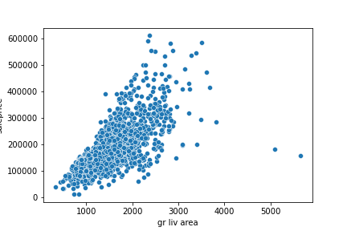
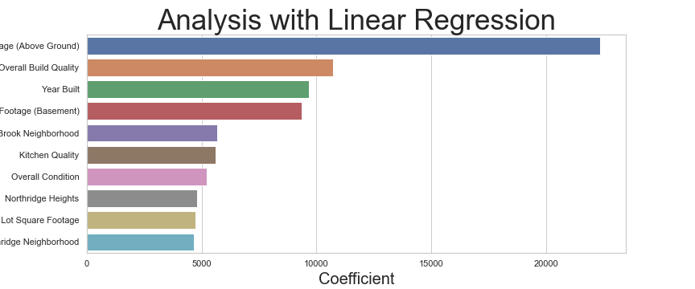

# Ames Housing Analysis Readme

## Problem Statement

Using data from over 2,000 homes sold in Ames, Iowa can we create a model to determine the best way to maximize the value of a home and find deals on the open market?

## Executive Summary

This project involves analyzing data on over 2,000 homes sales in Ames, Iowa. We'll seek to identify trends in the data and build a model that allows us to identify the features that are most impactful to housing prices on the open market. The data used for this analysis consists of five years (2006 - 2010) of sales figures including 81 features per home observation. Some moderate cleaning was necessary in order to prepare the data for modeling. First, two outliers were identified that needed to be addressed. These outliers were the only two homes with greater than 5,000 total square footage, yet both sold for only slightly above the mean sale price (~200,000 vs a mean of 180,000). The supplemental documentation for the dataset calls these out as being homes that may have been sold partially built, and recommends dropping from the analysis. We follow this guidance and drop both homes. 

The second order of data cleaning was the null values that were present in ~15 categorical variables. Per the supplemental documentation these null values were logged as such to indicate that the feature was not present in the home (i.e. NA for a basement feature indicates the home does not have a basement). These values were updated to a string indicating that the feature was missing ('no fireplace, 'no basement', etc.) to allow for One Hot Encoding. Once these issues were corrected the data was ready for modeling. First, the data was passed through standard scaler to allow for coefficients to be compared against eachother. Then the columns were transformed with all string columns being one hot encoded, and all remaining null values imputed using the median. Finally, a linear regression model was used with Lasso and an alpha value of 100. This led to an R^2 test score of 0.9199 and a test RMSE of ~24,000. Attempts were made to eliminate features with high multicolinearity, but the overall RMSE score was not improved.

Coefficients revealed that the largest driver of price was above ground square footage. All other variables held constant, one standard deviation (~500sqft) increase in square footage yields an increase in projected home value of ~25,000. Age of the home, overall build quality, higher end neighborhoods and basement square footage were also amongs the top 5 coefficients. 

## Data Dictionary

A full data dictionary is available [here](http://jse.amstat.org/v19n3/decock/DataDocumentation.txt) and a Kaggle competition associated with this project can be found [here](https://www.kaggle.com/c/dsir-907-project-2/leaderboard). 

## Conclusion and Recommendations

The recommendation to real estate investors centers around buying homes with immutable properties that are highly correlated with home price, while focusing on improving features with high coefficients prior to selling a home:

#### Recommendations - Home Buying

- Prioritize larger lot sizes when searching for homes. Lot size cannot be increased and each increase of 6609 lot square footage increases home values by ~5,000.
- Target the lowest priced homes in upscale neighborhoods. Lower end neighborhoods exert a downward pressure on home prices that renovations or a remodel are unlikely to counteract. 
- Target older homes. The sale price increases from a newer home can be achieved with a remodel, and homes built within the past 10 years sell for a premium.
- Optimize for homes that have solid build quality with premium materials such as brick. 

#### Recommendations - Home Selling

- Maximize square footage by building an addition to the house. A 500 sqft increase yields ~25,000 in increased home price. This number drops to ~10,000 for equivelant increases in basement sqft, so opt for above ground additions where possible. 
- Kitchen renovations are comparatively inexpensive and are a large driver in home value. 
- Clean up and make any necessary repairs! The condition of the home is one of the top 10 coefficents correlated with home value. 
